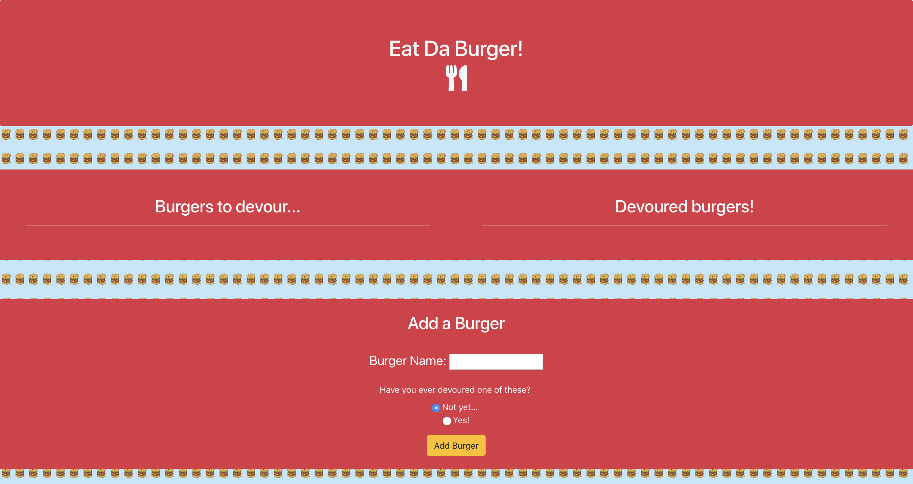
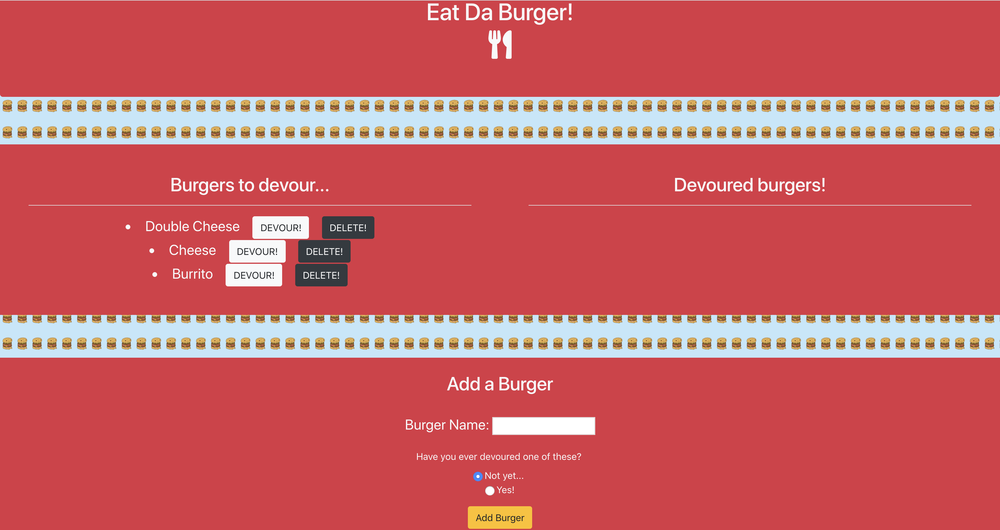
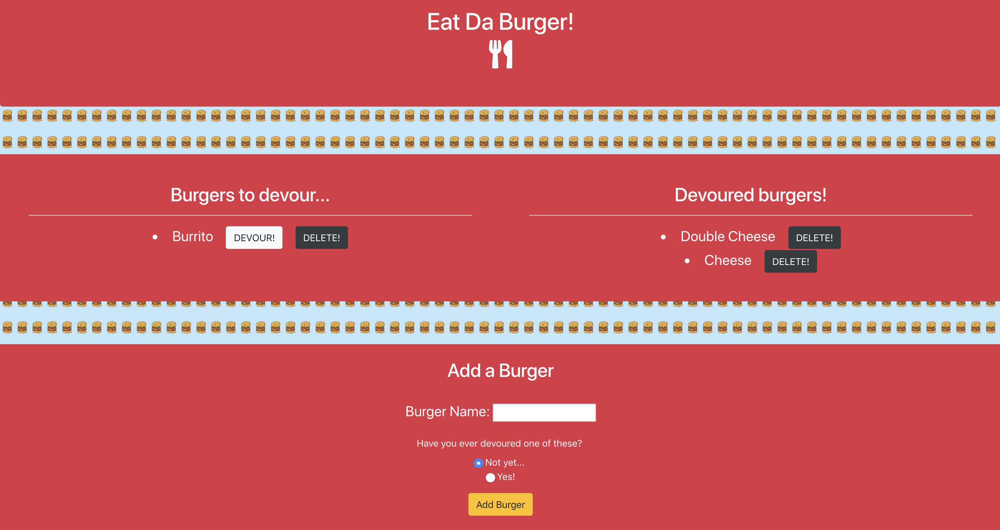

# Eat Da Burger!

### [Click here to go to the Application](https://devour-da-burgr.herokuapp.com/)

## What this is
A Node.js that allows users to add burgers to a bucket list and track which ones have been devoured.

The application is running on an express server and leveraged handlebars to display information stored in a mySQL database (managed by the jawsDB plugin on heroku). Following the VMC framework, db queries are managed by an ORM and all data is pushed to the front-end through handlebars.

## How it works

Enter any burger name to add it to the menu. This also adds the new burger entry into a remote MySQL database. Burgers that have yet to be devoured have a devour button and a delete button. 

The user may devour any burger by clicking on "devour", which moves it into the the devoured side and removes that button.

Enjoy!